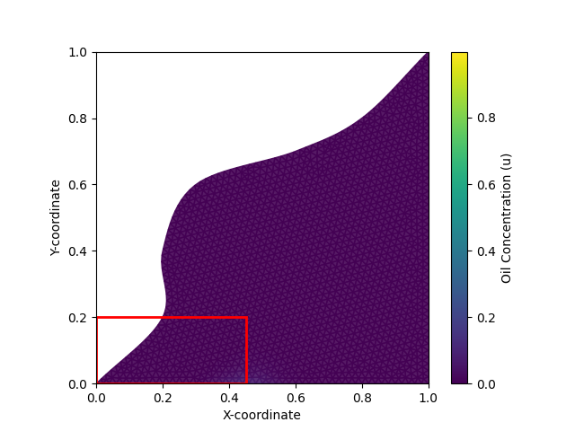

# Oil Spill Simulation on a Computational Mesh

This repository contains an educational simulation of an oil spill moving through the flow field around the fictional coastal area "Bay City". The area is represented as a triangular computational mesh. Oil transport is estimated from cell geometry, outward normals, neighboring cells, and a prescribed velocity field.

The project was developed as a three-person group assignment in INF202 at the Norwegian University of Life Sciences (NMBU) in January 2025. It is an academic model, not a tool for real-world environmental forecasting.



## Course submission and portfolio history

The original development and collaboration history was preserved from the group's GitLab repository. The annotated tag [`course-submission`](../../tree/course-submission) identifies the tracked Canvas submission, with generated caches and local log files excluded.

The `portfolio` branch continues from that point. Changes after the tag are portfolio maintenance or clearly identified post-submission improvements; they are not presented as part of the original course delivery.

- [Course report (PDF)](Group8ReportSimulationofanoilspill.pdf)
- [Original GitLab repository](https://gitlab.com/inf202gr8/computational-mesh)

## Result

The submitted model predicted that part of the oil spill would reach the defined fishing grounds. The course report records a maximum value of 30 in the fishing-ground measurement produced by the simulation. This result depends on the assignment's simplified flow field, numerical model, mesh, and parameter choices.

## Team and contributions

All members contributed as developers and worked collaboratively. The summaries below are based on the report and the preserved commit history; they describe recurring areas of work rather than exclusive ownership.

| Team member | Contribution summary |
| --- | --- |
| Ingrid Vestvik | Simulation and mesh testing, validation work, documentation and docstrings, and dependency maintenance. |
| Elias Sigurd Kroken | Core mesh and simulation development, plotting and animation, logging, generated outputs, and integration work. |
| Rajvir Singh Aujla | Configuration and TOML handling, entry-point integration, mesh and simulation tests, restructuring, and post-submission portfolio maintenance. |

## Project structure

```text
.
|-- input.toml                    # Example simulation configuration
|-- input_data/bay.msh            # Triangular mesh and flow-field input
|-- main.py                       # Command-line entry point
|-- packages/simulation/
|   |-- logger.py                 # Runtime logging
|   |-- msh_classes.py            # Mesh primitives and relationships
|   |-- plot_animation.py         # Images, plots, and video output
|   |-- readToml.py               # CLI and TOML configuration
|   `-- simulation.py             # Oil transport and simulation logic
|-- tests/                        # Pytest test suite
`-- requirements.txt             # Python dependencies
```

## Installation

The project was developed with Python 3.11. Other Python versions have not yet been verified.

```bash
python -m venv .venv
python -m pip install --upgrade pip
python -m pip install -r requirements.txt
```

Activate the virtual environment using the command appropriate for your shell before installing dependencies or running the project.

## Running the simulation

Run the default configuration:

```bash
python main.py
```

Run one selected TOML configuration:

```bash
python main.py -c input.toml
```

Find every TOML file in the current directory:

```bash
python main.py --find_all
```

Find every TOML file in another directory:

```bash
python main.py --find_all -f ./configs
```

The output directory is derived from the configuration filename. For example, `input.toml` writes images, a log, plots, video, and optional restart data under `input/`. The program asks interactively whether the final mesh state should be stored.

## Tests

```bash
python -m pytest
```

The tests cover important configuration, mesh, flux, and simulation behavior, but they are not a complete verification of every numerical routine.

## Known limitations from the course submission

- The implemented meaning of `writeFrequency` differs from the intended assignment interpretation.
- `reconstruct_mesh` does not reliably reconstruct arrays stored as strings in restart data.
- Test coverage is incomplete.
- The simulation uses a simplified prescribed flow field and should not be interpreted as a physical risk assessment.

## Post-submission changes

The first post-submission source commit made imports more explicit, adjusted mesh initialization order, restored an abstract method declaration, removed an unused import, and clarified documentation. Later portfolio commits improve repository documentation, configuration defaults, and dependency metadata. The `course-submission` tag remains the reference for the delivered version.
